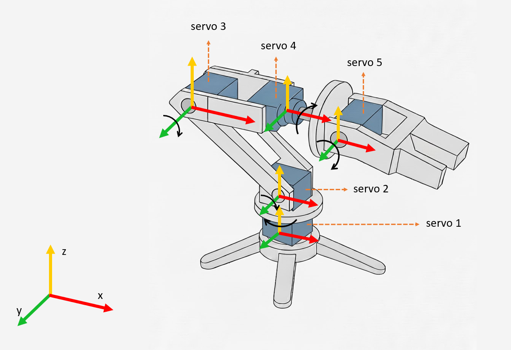

# Sistema anticolisiones para brazo robótico

El brazo robótico cuenta con cinco servomotores, cada uno asociado a una articulación rotacional. El modelo propuesto describe el movimiento del sistema mediante matrices de rotación y traslación, que se aplican **secuencialmente**.

## Transformaciones

### Eje de rotación identificados

Vamos a utilizar la siguiente representación del brazo con el que estamos trabajando, teniendo en cuenta el eje cartesiano definido y sobre el cual los servos rotan.



| Servo | Articulación | Eje de rotación |
| --- | --- | --- |
| 1 | Base | Z |
| 2 | Hombro | Y |
| 3 | Codo | Y |
| 4 | Muñeca | X |
| 5 | Pinza | Y |

### Estructura del modelo

Cada articulación se representa mediante una **rotación** sobre su eje correspondiente y una traslación a lo largo del eje del brazo. 

Las traslaciones permiten avanzar desde una articulación hacia la siguiente, mientras que las rotaciones determinan la orientación de cada eslabón.

Por lo tanto, el movimiento total del brazo puede representarse como el producto de transformaciones sucesivas.

$$
T = T_{01}\,\cdot\,T_{12}\,\cdot\,T_{23}\,\cdot\,T_{34}\,\cdot\,T_{45}
$$

donde cada $T_{ij}$ combina una rotación y una traslación entre dos articulaciones consecutivas. 

> *La transformación que lleva del sistema de coordenadas del eslabón i al sistema del eslabón j*
> 

**Ejemplo**

Sea la transformación $T_{12}$ que lleva del sistema de coordenadas del eslabón 1 (servo 2) al sistema del eslabón 2 (servo 3)

$$
T_{12} = R_y(\theta_2) \ .  \ T(L_1,0,0) 
$$

Donde $T(L_1,0,0)$ describe una traslación sobre el eje x local, con la longitud del eslabón. 

### Transformaciones completas

Teniendo en cuenta que la secuencia de ejes es: **Z - Y - Y - X - Y**

$$
T_{01} = R_z (\theta_1)  \ T(0,0,h_0) \\
$$ 

$$
T_{12} = R_y (\theta_2)  \ T(L_1,0,0) \\
$$

$$
T_{23} = R_z (\theta_3)  \ T(L_2,0,0) \\
$$

$$
T_{34} = R_z (\theta_4)  \ T(L_3,0,0) \\
$$

$$
T_{45} = R_z (\theta_5)  \ T(L_4,0,0) \\
$$

Donde:

- $h_0$ es la altura entre los servos 1 y 2
- $L_i$ es la longitud del eslabón $i$

### Traslaciones fijas

Si quisiéramos considerar las separaciones entre servos o existiese algún soporte que hace que el servo no este exactamente alineado con el anterior, podemos agregar a las transformaciones unas traslaciones constantes.

$$
T(\Delta x,\Delta y,\Delta z)
$$

donde:

- $\Delta x$: cuando se desplaza el eje siguiente hacia adelante o atrás,
- $\Delta y$: hacia el costado,
- $\Delta z$: hacia arriba o abajo.

## Esferas

A la hora de representar los eslabones, se va a utilizar esferas de un determinado radio para detectar las colisiones de manera simplificada. 

Cada eslabón $i$ va a tener asociado $n_i$ esferas. 

A cada esfera, se le asignará:

- Centro local: $c_{i,j} = [x_{i,j}, y_{i,j}, z_{i,j}, 1]^T$
- Radio $r_{i,j}$


💡Las posiciones locales se **definen una sola vez**


### Transformación a coordenadas globales

Para el sistema anticolisiones, es necesario transformar las posiciones locales en posiciones globales. 

Cuando el brazo adopta una postura concreta debido a un movimiento de algún servo, las posiciones **reales** de las esferas se obtienen aplicando la cadena de matrices de transformación **acumuladas hasta ese eslabón**.

$$
c_{i,j}^{glob} = T_{0 \rightarrow i} \ . \ c_{i,j}^{loc}
$$

donde: 

- $c_{i,j}^{glob}$ es el centro global de la esfera $j$ del eslabón $i$

### Medición de la autocolisión

La medición de la autocolisión se realizará con las **coordenadas globales**.

Una vez transformadas las posiciones locales a globales mediante las transformaciones correspondientes, se debe determinar si la distancia entre dos centros de esferas es menor que la suma de sus radios:

$$
\text{distancia }d = ||c_A - c_B|| = \sqrt{(x_A-x_B)^2 + (y_A-y_B)^2 + (z_A-z_B)^2  } < r_{A} + r_{B}
$$

donde las coordenadas de A y B corresponden a las coordenadas de los centros globales de las esferas involucradas.


💡 Debemos agregar un $\delta$ el cual cumpliría la función de margen de seguridad ya que en la práctica no se espera a que las superficies se **toquen**. El valor de dicho margen será del valor en mm y queda a elección del diseñador.  


### Consideraciones en la medición - falsos positivos

En un brazo articulado representado por esferas, no todas ellas deben compararse entre sí para detectar autocolisiones debido a que muchas **están unidas fisicamente por un mismo eslabón** (o por eslabones consecutivos) y siempre estarán cerca entre sí sin que eso implique choque.


💡 Comparar todas las esferas implica obtener **falsos positivos constantes.**


Entonces se debe determinar quien puede chocar realmente con quién.

**Tipos de colisión**

- Autocolisión real: este tipo de colision ocurre entre partes del brazo que pueden tocarse físicamente.
- Contacto físico (sin riesgo): este tipo de “”colisión”” ocurre entre partes unidas o vecinas del brazo. Debemos **excluir** este tipo de colisiones en los cálculos.

**Regla general de exclusión —> A CHEQUEAR**

Si cada eslabón está conectado solo con su vecino y su vecino siguiente, entonces el cálculo de distancia entre esferas no debe realizarse entre aquellas que pertenecen al mismo eslabón ni a eslabones consecutivos.

## Anexo - Pseudocódigo propuesto

```c
loop:
	// ===========================================================
	// 1. LECTURA DE ENTRADAS
	// ===========================================================
	servo_activo = leer_boton_servo()               // Determina cuál servo está seleccionado
	valor_pot = leer_potenciometro()                // Lectura analógica del potenciómetro

	// ===========================================================
	// 2. CÁLCULO DEL ÁNGULO PROPUESTO
	// ===========================================================
	angulo_propuesto = map_lectura_a_angulo(valor_pot, servo_activo)
	angulo_propuesto = limitar_rango(angulo_propuesto,
	                                 min_angle[servo_activo],
	                                 max_angle[servo_activo])

	// ===========================================================
	// 3. CÁLCULO DE LA DIFERENCIA ANGULAR (Δθ)
	// ===========================================================
	angulo_actual = θ[servo_activo]
	delta = angulo_propuesto - angulo_actual

	// Si lo que se leyo en realidad fue ruido eléctrico, no hacer nada
	if abs(delta) < DEADZONE: // DEADZONE podría ser 1 o 2 grados
		continue loop

	// Limitar paso máximo por ciclo para suavizar el movimiento
	delta = limitar(delta, -STEP_MAX[servo_activo], STEP_MAX[servo_activo])

	// ===========================================================
	// 4. SIMULACIÓN DE MOVIMIENTO EN SUBPASOS
	// ===========================================================
	// Se evalúa el recorrido del servo antes de aplicarlo físicamente
	colision_detectada = false

	for s in 1..S:
		// Calcular ángulo intermedio
		angulo_intermedio = angulo_actual + delta * (s / S)

		// Actualizar ángulo del servo en simulación
		θ[servo_activo] = angulo_intermedio

		// Recalcular cinemática directa desde este servo hacia adelante
		actualizar_transformaciones_desde(servo_activo)

		// Actualizar posiciones globales de las esferas
		actualizar_posiciones_esferas_desde(servo_activo)

		// Verificar posibles colisiones
		if verificar_colision_esferas(δ):
			colision_detectada = true
			break   // salir del bucle de subpasos

	// ===========================================================
	// 5. APLICACIÓN O BLOQUEO DEL MOVIMIENTO
	// ===========================================================
	if colision_detectada:
		// Riesgo de colisión → no mover el servo
		θ[servo_activo] = angulo_actual                 // volver al último seguro
		bloqueado[servo_activo] = true
		indicar_estado("RIESGO DETECTADO", servo_activo)
	else:
		// Movimiento seguro → aplicar ángulo final
		θ[servo_activo] = angulo_actual + delta
		bloqueado[servo_activo] = false
		enviar_angulo_a_servo(servo_activo, θ[servo_activo])
		guardar_ultima_postura_segura(θ)

	// ===========================================================
	// 6. FIN DE CICLO / ESPERA
	// ===========================================================
	actualizar_display_estado()
	esperar_siguiente_ciclo()
	go to loop
```


## Anexo - Estados internos a mantener

A continuación se detallará las variables necesarias para poder implementar este sistemas de anticolisiones.

### Estado interno - servos

- Angulos actuales (de los servos)
- Angulo objetivo (propuesto por el potenciómetro)
- Límites mecánicos de cada servo (min y máx)
- ¿Velocidad máxima?
- Transformaciones acumuladas (matrices de rotación y traslación)
- Coordenadas locales de los centros de las esferas para cada eslabón
- Coordenadas globales de los centros de las esferas para cada eslabón

### Estado interno - parámetros estructurales y geometría

- Longitud de cada eslabón
- Eje de rotación de los servos
- $h_0$ = altura de la base respecto al plano

### Estado interno - estados de control y seguridad

- Variable indicadora de si el sistema está libre de colisiones
- Flag de riesgo de colisión
- Última configuración segura del servo $i$
- Margen de seguridad $\delta$

### Estado interno - esferas

- Coordenadas locales de la esfera $j$ del eslabón $i$
- Coordenadas globales de la esfera $j$ del eslabón $i$
- Radio de la esfera $j$ del eslabón $i$
- Matriz boleana que indique entre qué pares de esferas se debe calcular la distancia

### Estado interno - transformaciones

- Matriz de transformación acumulada (desde la base hasta el eslabón i)
- Matriz de transformación local (Es decir $T_{ij}$ donde $i = j-1$)
- Posición del origen del eslabón i

### Estado interno - estados de control y seguridad

- Servo seleccionado
- Valor del potenciómetro
- Estado de los pulsadores